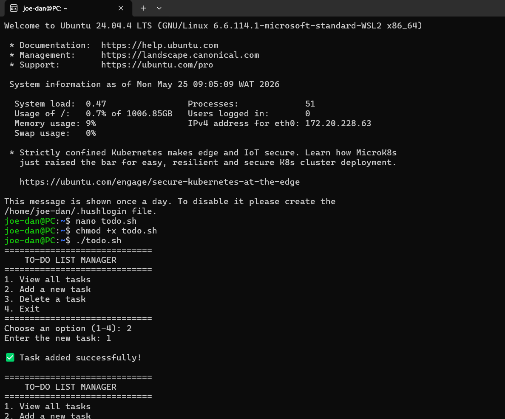
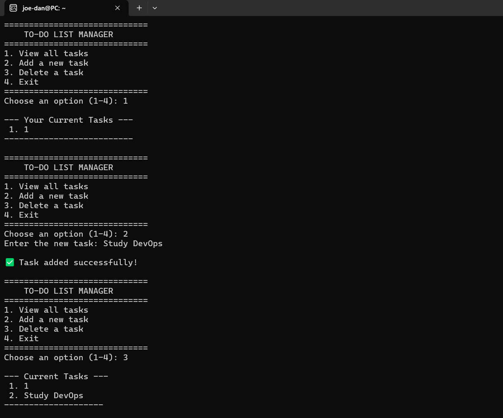
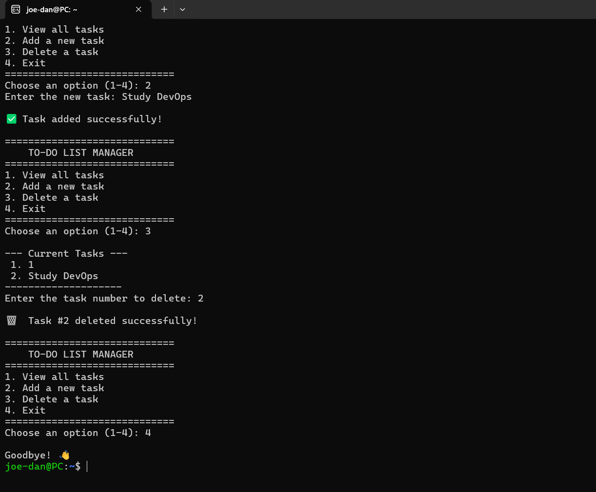

# Shell Fundamentals: Interactive To-Do List Manager

A simple, interactive command-line To-Do List application written in Bash.

## Project Walkthrough

### 1. Script Setup
I created and granted execution permissions to the todo.sh script.

### 2. Adding Tasks
I utilized the application menu to append tasks to the persistent text file.

### 3. Deleting Tasks and Exiting
I removed tasks by line number using stream editing and exited cleanly.

